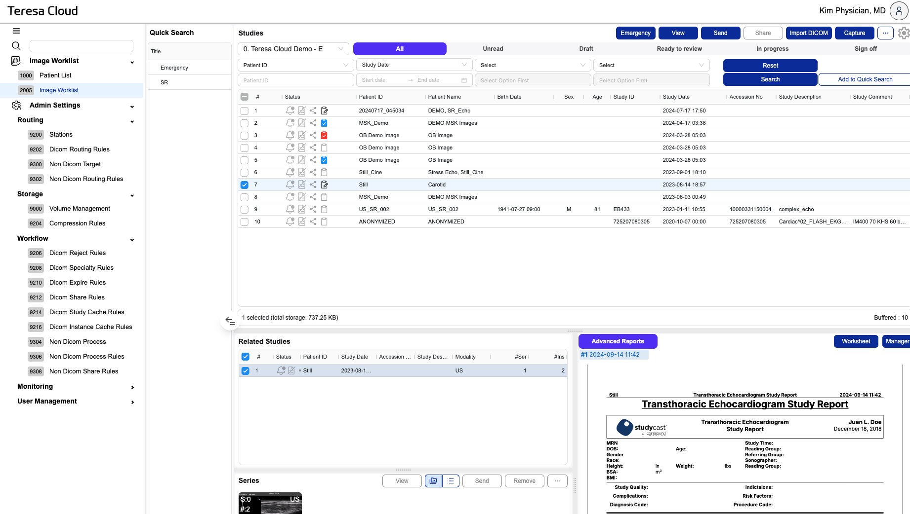

# GUI Overview

## I-one DICOM Viewer: Essential aspects of the interface 

The following image shows the main elements of the graphical user interface (GUI). For more detailed documentation on the various elements of the interface, click on the green or blue areas of the image.

The interface of the default DICOM workspace consists mainly of 2 parts:

The DICOM Explorer on the left (in blue). It allows you to import and export data, as well as select the series to be visualized.
Depending on the data imported, different viewer/player types (represented by a tab) are displayed in the main section (green). Menus , toolbars and tools change according to the type of viewer selected.
The selected viewer is the image above is the DICOM 2D viewer  which is the viewer opened by default.
A tab containing a multi-view layout can display images from only one patient. However, one patient can appear in several tabs.
A tab is also docked panel that can be arranged by dragging and dropping it to the desired location. This makes it possible to display 2 tabs side by side.
See also DICOM Explorer to understand how to navigate through the Patient/Study/Series/Image.

!!!primary Note
Select your preferred language and regional settings in the preferences. Adapt the graphical interface to your needs by modifying the theme or the scaling factor for a better user experience on HiDPI screens.
!!!

!!! Tip 💁‍♂️
In the View menu at the top, toolbars and tools related to the selected viewer can be shown or hidden. These display preferences are retained even after a restart. Only Explorer preferences are retained for the duration of the session.
!!!

List of other viewers/Players in the DICOM workspace

DICOM Structured Report (SR) viewer
DICOM PDF viewer (default system application associated with pdf files). Same for other encapsulated documents.
DICOM Video player (default system player associated with mpg files)
List of other workspaces
Dicomizer
Explorer of standard images (based on the non-dicom-explorer.json configuration profile)

