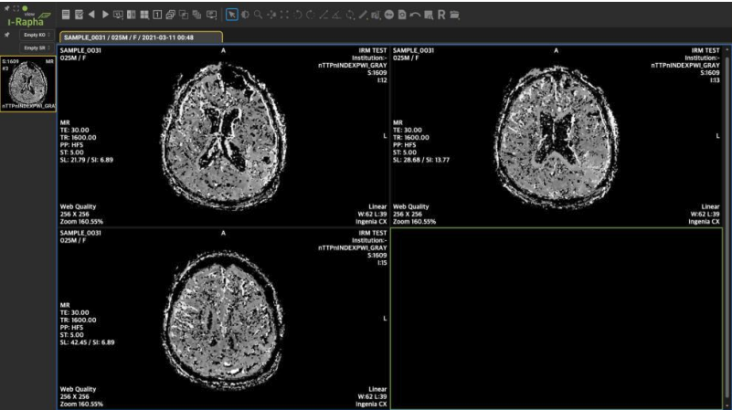
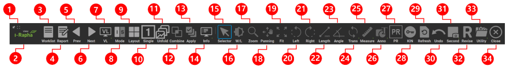

## GUI Overview

데이터조회 화면에서 선택한 데이터의 영상을 아래와 같이 I-Rapha View™를 통해서 확인합니다.

-Rapha View™는 DICOM 형태의 영상을 표시하고 진단 및 판독에 필요한 여러가지 의료영상 조작
기능을 제공하고 있습니다.
I-Rapha View™의 화면은 메뉴바, 토글버튼, 시리즈썸네일창, 영상 표시창으로 구성되어 있습니다.

메뉴바: 의료영상을 조회, 판독하기 위해 필요한 기능을 나열하여 보여줍니다.
시리즈: 썸네일창 현재 표시되는 스터디의 시리즈를 썸네일로 나열하여 보여줍니다.
스터디탭: 뷰어에 열려 있는 스터디의 정보를 보여줍니다.
영상 표시창: 의료영상을 보여주는 화면입니다.

I-Rapha View™ 상단에 위치한 메뉴바(menubar)는 의료 영상을 조회, 판독하기 위한 여러가지
기능(Overlay, Transformations, filtering 등)을 메타포와 툴팁을 포함하여 나타냅니다.
메뉴바에 표시되는 메뉴의 항목은 뷰어의 모드에 따라 변경됩니다.
※ 모드에 대한 내용은 『VII I-Rapha View™ 기능』의 해당 내용을 참조하시기 바랍니다

Maximize: I-Rapha View™를 화면 크기에 맞게 최대화합니다.
Viewer Info: I-Rapha View™의 버전 및 제조사의 연락처가 기재된 팝업이 표시됩니다.
Worklist: 워크리스트로 이동합니다.
Report: 리포트창을 실행합니다.
Prev Study Worklist: 상에서 현재 Study의 전에 있는 Study를 엽니다.
Next Study Worklist: 상에서 현재 Study의 다음에 있는 Study를 엽니다.
Virtual Layout: 뷰어의 가상 레이아웃을 변경합니다.
Mode: 영상을 표시하는 모드를 변경합니다.
Layout: 각 영상을 표시하는 배열의 행과 열의 수를 지정합니다.
Single View: 현재 선택된 영상만을 뷰어 전체화면으로 보여줍니다.
Unfold: 멀티프레임 영상의 경우, 각 프레임을 펼쳐서 모든 영상을 표시합니다.
Combine Series: 모든 시리즈를 하나로 병합할 수 있습니다. 시리즈 썸네일을 더블클릭해도 됩니다.
Apply All: 이미지 처리 적용범위를 나타내는 것으로 On일 경우 시리즈 내 모든 의료 영상에 적용됩니다.

- Measurements
    - Poly Line: 폴리라인(꺾임선)을 이용하여 길이를 측정합니다. 폴리라인의 총 길이가 표시됩니다.
    - Polygon: 직선으로 이루어진 다각형 영역의 둘레 길이, 영역 내부의 픽셀 최소값/최대값, 픽셀 평균값, 픽셀값의 표준편차를 측정합니다.
    - Free Line: 프리라인(자유곡선)을 이용하여 전체길이를 측정합니다.
    - Closed Line: 폐곡선 영역의 둘레 길이, 영역 내부의 픽셀 최소값/최대값, 픽셀 평균값, 픽셀값 표준편차를 측정합니다.
    - Curve Line: 직선을 한쪽으로 휘게 하여 대칭곡선을 만들고 곡선의 전체 길이를 측정합니다.
    - Center Line: 두 개의 직선을 이용하여 각 선의 길이와 각 선의 중심점을 연결한 각도를 측정합니다. 골격등의 부위별 두께와 각도를 측정할 수 있습니다.
    - Circle (M): 원을 이용하여 넓이를 측정합니다. 원의 내부의 넓이가 표시됩
    - Ellipse (M) 타원 영역의 내부 넓이를 측정하고 표시합니다.
    - Rectangle (M): 사각형을 이용하여 넓이를 측정합니다. 사각형 내부의 넓이가 표시됩니다.
    - Magnifier: 영상의 일부분을 확대하여 표시합니다.
    - Points Angle: 지정한 3 개의 점이 이루는 각도를 표시합니다.
    - Cobb’s Angle: Cobb 앵글을 측정합니다. 척추의 만곡도(굽은정도)를 측정할 때 사용합니다.
    - Pixel Value: 지정된 Piexel의 2 차원 또는 3 차원 좌표상의 위치값과 컬러값 (CT의 경우 하운스필드값)을 표시합니다.
    - Pixel HU Value: 마우스로 클릭한 위치의 픽셀 값을 저장합니다.
    - CT Ratio CT Ratio(Cardiothoracic Ratio, 심흉비)를 측정합니다.
    - Calibrate: 픽셀의 길이정보(mm)가 없거나 부정확한 경우, 단위길이를 다시 지정하여 전체 측정값을 재계산합니다.

- Annotations
    - Line 영상 위에 직선 주석을 삽입합니다.
    - Arrow Line 영상 위에 화살표 주석을 삽입합니다.
    - Curve 영상 위에 곡선 주석을 삽입합니다.
    - Arrow Curve 영상 위에 휘어진 화살표 주석을 삽입합니다.
    - Free Line 영상 위에 자유선 주석을 삽입합니다.
    - Closed Line 영상 위에 폐곡선 주석을 삽입합니다.
    - Circle 영상 위에 원 주석을 삽입합니다.
    - Ellipse 영상 위에 타원 주석을 그립니다.
    - Rectangle 영상 위에 사각형 주석을 삽입합니다.
    - Localization 영상 위에 위치표시점을 삽입합니다.
    - Text 영상 위에 글자 주석을 삽입합니다.

- Refresh: 메뉴바의 [Refresh]는 영상이 뷰어에 로딩된 이후에 새로 추가된 영상을 보기 위해서 영상을 뷰어에서 다시 로딩합니다.

- Undo(실행취소): 메뉴바의 [Undo] 는 영상에 마지막으로 삽입된 주석(Annotation)이나 측정(Measurement)을 취소합니다.

- Capture: 메뉴바의 [Capture] 는 영상이나 뷰어의 특정 영역을 캡쳐하여 DICOM 이미지로 생성합니다.

- Revise : 메뉴바의 [Revise] 메뉴는 영상에 마킹을 추가하거나 영상을 편집하여 다시 저장할 수 있는 Revise 창을 띄웁니다.

----

DICOM 선택된 영상의 DICOM Information 창을 띄웁니다.
Copy 선택된 영상을 클립보드에 저장합니다.
Save 영상에 입력된 주석을 수동으로 저장합니다.
Setting 뷰어의 환경설정 창을 띄웁니다.

feel like I've been overthinking lately
the less I know myself
the more I dream of greatness

fill my heart with inspiration
never knew how sweet life could be

-----
시리즈 내 모든 영상 적용(Apply All): 메뉴바의 [Apply All] 메뉴는 이미지모드(Image Mode)가 선택되었을 때 나타나는 메뉴이며 [Apply
All] 메뉴가 ON 상태일 경우 시리즈 내의 모든 영상에 영상 조작 기능(Zoom, Window Width/Level 조정 등)을 동시에 적용됩니다.
[Apply All] 메뉴가 OFF 상태일 경우에는 선택된 영상에만 영상 조작 기능이 적용되며, 시리즈 내의 다른 영상에는 영향을 미치지 않습니다. 만일 동일한 영상 조작 기능을 시리즈 내의 다른 영상에 적용하기 위해서는 동일한 작업을 반복해야 합니다.
[Apply All] 메뉴는 토글 방식으로 작동하며, [Combine] 메뉴를 클릭하면 현재 적용된 상태에서 다른 상태로 변경이 됩니다. 기본 상태는 ON 상태입니다

-----

- 스터디탭(Study Tab)
현재 뷰어에 로딩되어 있는 스터디의 정보를 보여주며, 현재 뷰어에 로딩되어 있는 스터디마다 하나의 스터디탭이 생성됩니다. 현재 뷰어에 표시되고 있는 스터디의 스터디탭은 배경이 청록색으로 표시되며, 로딩은 되었으나 표시가 되고 있지 않은 스터디의 스터디탭은 회색으로 표시됩니다.

스터디탭(Study Tab)에 표시되는 정보는 아래와 같습니다.
    1. Patient Name 환자 이름
    2. Exam Date 촬영일자
    3. Sex 성별(M: 남, F: 여, O: 기타)
    4. Age 나이(Y: 년, M: 월, D: 일)

